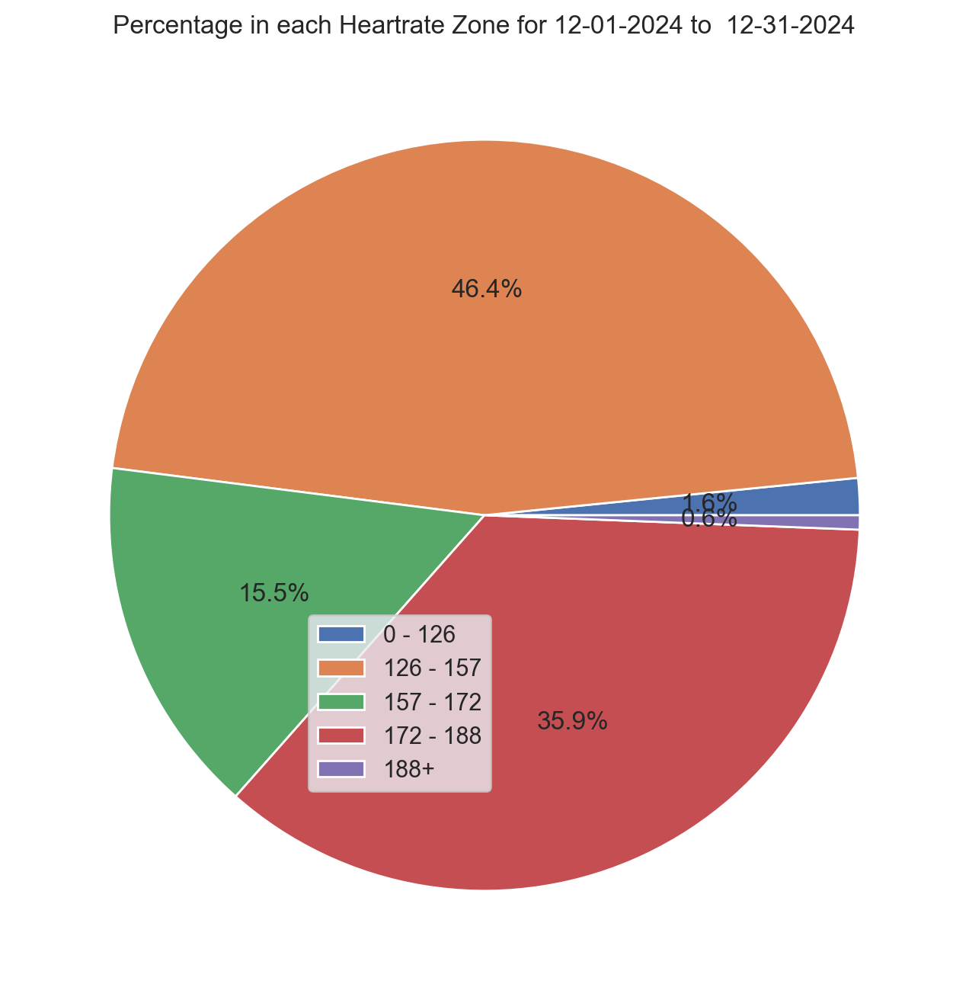
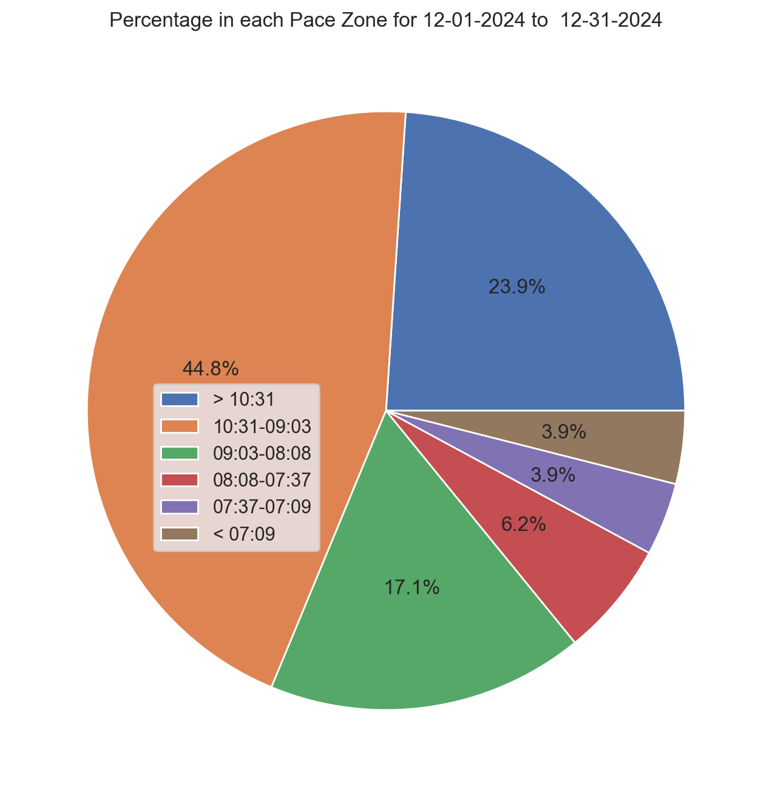

# Strava Pace Aggregator

Strava natively tracks the time a user spends in each pace and heartrate zone for each activity they upload. This
program takes all a user's activities in a provided date range and aggregates the time spent in those pace and heartrate
zones during that range.

The outputs are two pie charts (of which there are examples of below) that visualize the amount of time in percentages
that was spent in each zone during the date range.

## Some notes about this program

- Strava's API has the following rate limits:
    - **Overall Rate Limits:** 200 requests every 15 minutes, 2,000 daily
    - **Read Rate Limits:** 100 requests every 15 minutes, 1,000 daily
- With those rate limits in mind, you'll want to be mindful of the date range you set for your activities. You could
  easily run into the rate limit because this program makes an API call for each activity. My suggested usage of this
  tool is to see how you're trending weekly or monthly.
- If you've modified your zones in Strava during the requested date range, your pie charts will reflect your new and
  previous zones. To get cleaner charts, request a date range with consistent zones.
- When prompted for your date ranges in the terminal, it's important to enter them as `MM-DD-YYYY` as requested. They
  will not be converted to epoch timestamps properly if entered otherwise.
    - The `before` parameter is NOT inclusive. The `after`parameter IS inclusive.

## Running this program

In order to run this program, you'll need:

- A Strava account.
- At least one activity recorded on that Strava account and one saved piece of gear associated with that activity.
- A personal API application on that Strava account.
    - and the corresponding `client_id`, `client_secret` and `refresh_token` for that API application.

Below instructions are provided for creating a personal API application and retrieving the necessary values to run this
program. Please note that, in the settings for your personal API application, you will find a refresh token; however,
that is not a substitute for the steps below describing how to retrieve a refresh token for use by this program. The
token provided in the settings page for your personal application only has read access, and this program requires a
token with read all access.

### How to get client_id and client_secret

- Create an API Application on Strava at [https://www.strava.com/settings/api ](https://www.strava.com/settings/api) and
  set the Authorization Callback Domain to localhost
- Navigate back to [https://www.strava.com/settings/api ](https://www.strava.com/settings/api) and you should see Client
  ID, Client Secret, Your Access Token, and Your Refresh Token

### How to request a refresh_token

- Replace the values in the following template with the appropriate values from your API application's settings page and
  navigate to the URL in a
  browser: `https://www.strava.com/oauth/authorize?client_id=[your_client_id]&response_type=code&redirect_uri=http://localhost/exchange_token&approval_prompt=force&scope=activity:read_all`
- Copy the code provided in the URL after authorizing your app. The URL should look like
  this: `http://localhost/exchange_token?state=&code=[CODE]&scope=read,activity:read_all`
- Make the following GET request either from the commandline or a GUI like Postman or HTTPie:

````
curl --request POST \
  --url 'https://www.strava.com/oauth/token?client_id=[your_client_id]&client_secret=[your_client_secret]&code=[CODE]&grant_type=authorization_code'
````

- Your refresh token will be in the response as `"refresh_token"`

### How to add these values to the program

Once you have your `refresh_token`, `client_secret` and `client_id` ready, you can either replace the values in the
payload array with your values or add them to the `login.example.py` file and remove the "example" from the file name.
The login file is imported in the main program and its values are inserted into the payload via f-strings.

```
payload = {
    'client_id': f'{login.client_id}',
    'client_secret': f'{login.client_secret}',
    'refresh_token': f'{login.refresh_token}',
    'grant_type': "refresh_token",
    'f': 'json'
}
```

## Image Examples


